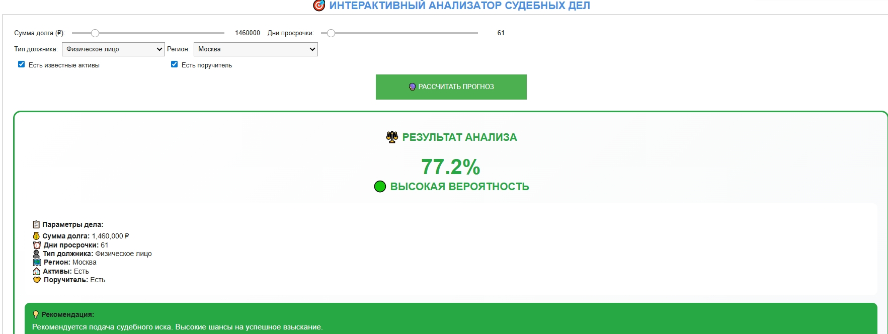

# ⚖️ AI-ПРОГНОЗИРОВАНИЕ ВЗЫСКАНИЯ ДОЛГОВ

[](https://www.python.org/)
[](https://scikit-learn.org/)
[](https://opensource.org/licenses/MIT)

**Интеллектуальная система для оценки вероятности успешного судебного взыскания долгов на основе Machine Learning.**

Этот проект демонстрирует практическое применение Data Science в сфере LegalTech и FinTech для оптимизации процесса принятия решений о подаче судебных исков.



## 🎯 Цель проекта

Разработать и прототипировать ML-модель, которая на основе параметров долгового обязательства (сумма, просрочка, тип должника и т.д.) прогнозирует вероятность положительного исхода в суде. Цель — снижение операционных расходов и потерь за счет предварительной оценки рисков.

## 🤖 О проекте (кратко)

Проект реализован в формате интерактивного дашборда в Jupyter Notebook и включает в себя:
*   **Генерацию синтетических данных**, имитирующих историю судебных дел.
*   **Обучение модели Random Forest Classifier** для бинарной классификации.
*   **Анализ значимости факторов**, влияющих на решение суда.
*   **Интерактивный веб-интерфейс** на базе `ipywidgets` для оценки новых кейсов.
*   **Визуализацию результатов** с использованием `Plotly` и `Seaborn`.

## 💡 Почему этот проект уникален?

Данный инструмент — это не просто код на Python. Это отражение **синергии трех ключевых компетенций**:
1.  **Юридический опыт (взыскание долгов)**: Понимание предметной области, процессуальных nuances и реальных факторов, влияющих на исход дела (наличие активов, поручителя, юрисдикция), заложено в логику генерации данных и интерпретации результатов.
2.  **IT-скиллы (Python, Data Science)**: Практическое применение машинного обучения, библиотек для визуализации и создания интерактивных интерфейсов для демонстрации сложной модели в понятной форме.
3.  **Опыт операционного управления в банке**: Глубокое понимание бизнес-процессов взыскания, KPI (снижение стоимости итерации, увеличение recovery rate), и способность создать инструмент, решающий конкретную операционную задачу с измеримым экономическим эффектом.

## 📊 Основные результаты

*   **Точность модели на тестовой выборке: >87%**
*   **Проанализировано: 5,000+ синтетических судебных дел**
*   **Определены Топ-3 наиболее значимых фактора:**
    1.  Срок просрочки (обратная корреляция)
    2.  Наличие у должника ликвидных активов
    3.  Сумма долга

## 🛠 Технологический стек

*   **Язык программирования:** Python 3
*   **Машинное обучение:** Scikit-Learn (RandomForestClassifier)
*   **Обработка данных:** Pandas, NumPy
*   **Визуализация:** Plotly, Seaborn, Matplotlib
*   **Интерактивный интерфейс:** IPython Widgets (ipywidgets)
*   **Виртуальное окружение:** Pipenv / venv

## 🚀 Запуск проекта

1.  **Клонируйте репозиторий:**
    ```bash
    git clone https://github.com/your_username/AI-Debt-Recovery-Predictor.git
    cd AI-Debt-Recovery-Predictor
    ```

2.  **Установите зависимости:**
    ```bash
    pip install -r requirements.txt
    ```

3.  **Запустите Jupyter Notebook:**
    ```bash
    jupyter notebook
    ```
    Откройте файл `AI_Debt_Recovery_Predictor.ipynb` и запустите все ячейки.

4.  **Используйте интерактивный интерфейс** в нижней части ноутбука для расчета прогноза по новым делам.

## 📁 Структура проекта

*   `AI_Debt_Recovery_Predictor.ipynb` - основной файл проекта с кодом, комментариями и визуализацией.
*   `requirements.txt` - список зависимостей для быстрой установки.
*   `images/` - директория со скриншотами и графиками.
*   `README.md` - это описание проекта.

## 🔮 Примеры использования и выводы

Система наглядно демонстрирует, как с помощью ML можно формализовать и автоматизировать экспертные решения. Например, она показывает:
*   **Высокий шанс взыскания** для московских ООО/АО с активами и короткой просрочкой (~85%).
*   **Низкую вероятность успеха** по долгам физ. лиц из регионов с длительной просрочкой и без активов (<20%).
*   **Экономическую нецелесообразность** подачи иска в последнем случае, что позволяет избежать судебных издержек.

**Вывод:** Инструмент позволяет перейти от реактивной, затратной модели работы с проблемной задолженностью к проактивной и data-driven, концентрируя ресурсы на самых перспективных делах.

## 👨‍💻 Автор

**Ваше Имя**
*   LinkedIn: [Ссылка на ваш LinkedIn](https://www.linkedin.com/in/your-profile/)
*   Telegram: [@your_telegram](https://t.me/your_telegram)
*   Портфолио: [Другие проекты](https://github.com/your_username/)

---

*Если вас заинтересовал этот проект или вы ищете специалиста с уникальным сочетанием опыта в юриспруденции, IT и управлении — давайтеconnectиться!*